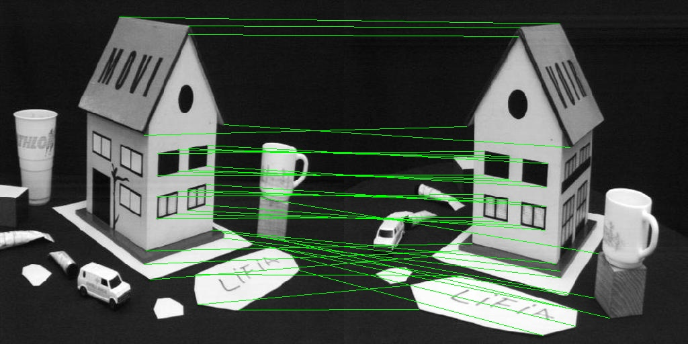
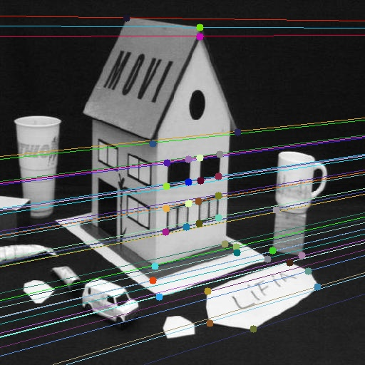
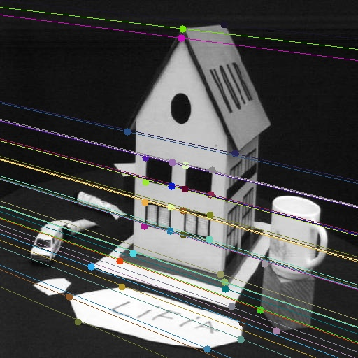

# Epipolar Geometry and 8-Point Algorithm

## About

Estimate the Fundamental Matrix of an un-calibrated camera using the 8-Point Algorithm.

## Algorithm

<ul>
  <li>Normalize the image points for better numerical conditioning.</li>
  <li>Linear estimation: from the epipolar constraint equation, build the linear system with the entries of F as the unknowns and solve it using SVD</li>
  <li>Enforce rank-2 condition: the estimated matrix may not necessarily satisfy the rank-2 condition of a Fundamental matrix. Enforce this constraint explicitly using SVD by setting the last singular value to 0</li>
  <li>Denormalize the estimated fundamental matrix</li>
</ul>

## Input

 

## Output

 

